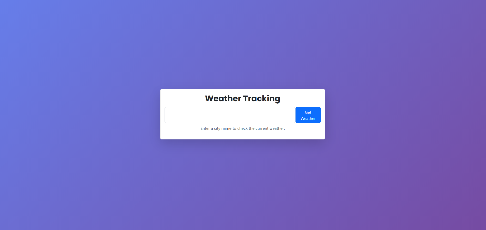
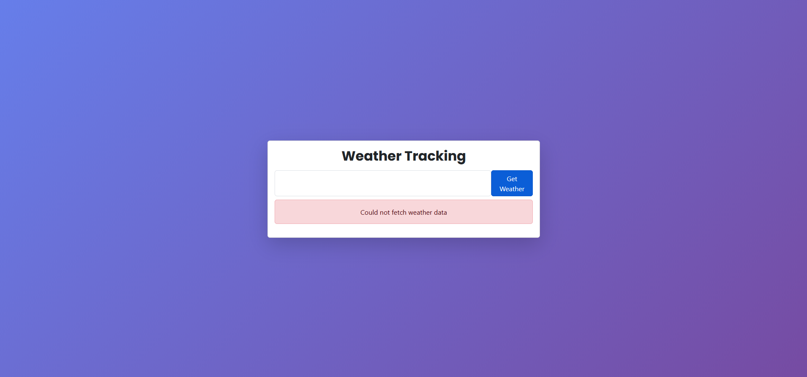
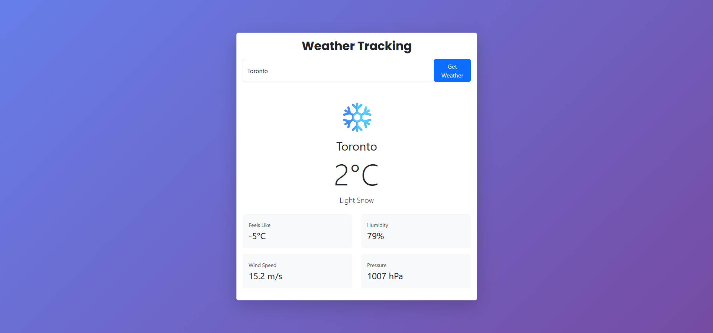
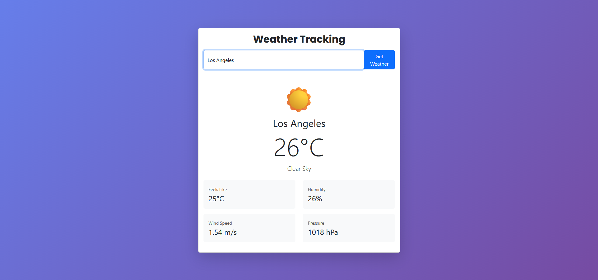
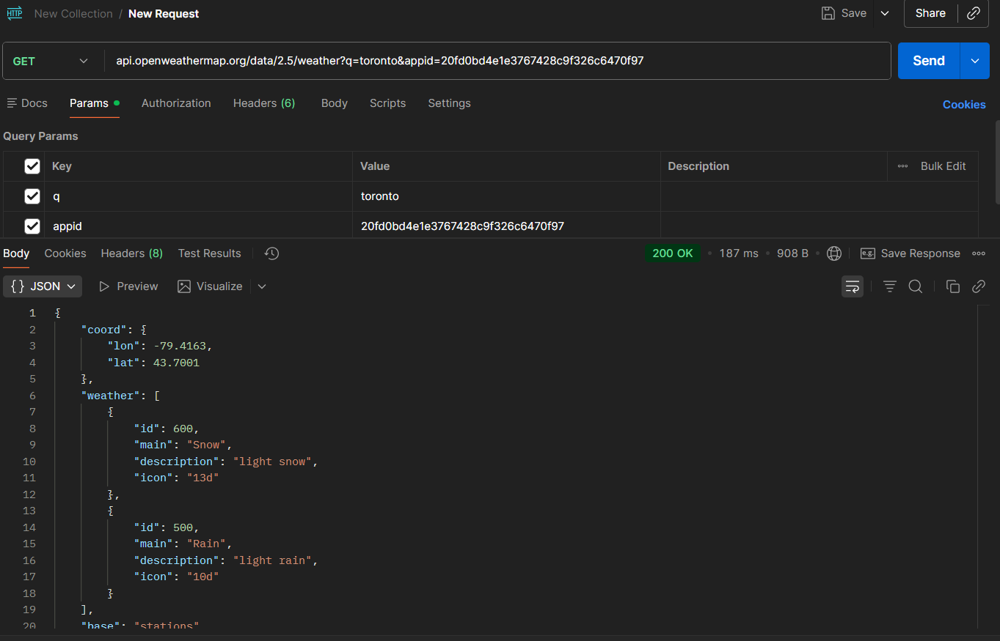

# Project Log
***
1. Initially fumble and cause a commit unattached to the head, reclone the repository  
2. Create an account and get an API key form openweathermap  
3. Initialize the react app with npx create-react-app  
4. Scaffold in the initial card for the app
5. Author the weather fetch function
6. Test fetch function with logging
7. finish and style the user interface
8. Add helper function for cute emojis based on weather conditions
***
# Deployment
I deployed the app using Vercel.
The live version can be found [here](https://101505655-comp3123-labtest2.vercel.app/)
***
# Weather App
*Below are screenshots of the application in action, as well as a screenshot of Postman successfully
fetching data using the OpenWeatherMap API and my API key.*
***
On startup of the app

Example of an error when an invalid/empty city is provided

Example of a cold weather response, including dynamic emoji

Example of a hot weather response, including dynamic emoji

Postman successfully fetching data from OpenWeatherMap API
